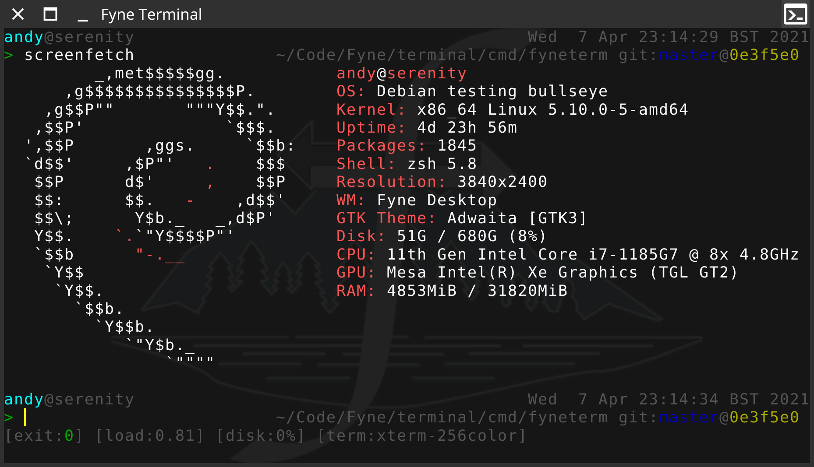
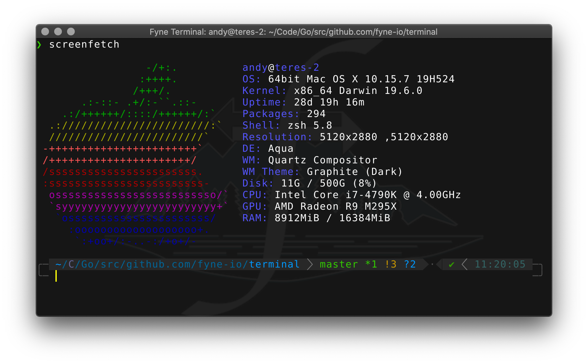
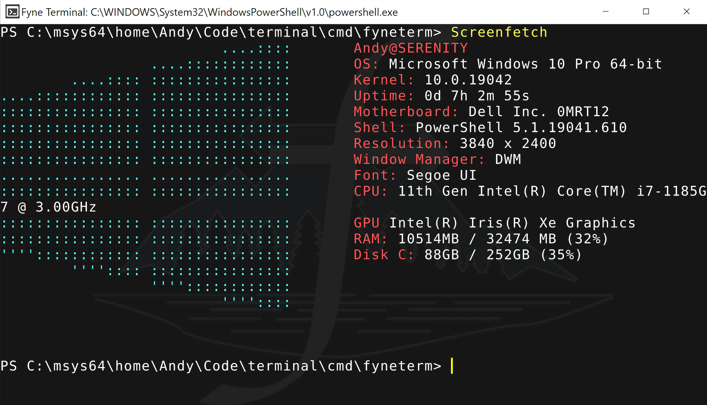

<p align="center">
  <a href="https://goreportcard.com/report/github.com/fyne-io/terminal"></a>
  <a href="https://github.com/fyne-io/terminal/actions"></a>
  <a href='https://coveralls.io/github/fyne-io/terminal?branch=master'></a>
  <a href='http://gophers.slack.com/messages/fyne'></a>
</p>

# Fyne Terminal

A terminal emulator using the Fyne toolkit, supports Linux, macOS, Windows and BSD.

Running on Linux with a custom zsh theme.


Running on macOS with a powerlevel10k zsh theme and classic style.


Running on Windows with PowerShell running inside.


# Installing on command line

Just use the go get command (you'll need a Go and C compiler installed first):

```
go install github.com/fyne-io/terminal/cmd/fyneterm@latest
```

# Installing as an app

To get the app installed alongside your other applications (with metadata, icons etc),
use the `fyne` tool, as illustrated below:

```
$ go get fyne.io/fyne/v2/cmd/fyne
$ fyne get github.com/fyne-io/terminal/cmd/fyneterm
```

# TODO

There are lots of great things that could be added to this app.
Already planned is:

* Tabs
* Scroll-back
* Background and font/size customisation
* Split panels

# Library

You can also use this project as a library to create your own
terminal based applications, using the import path "github.com/fyne-io/terminal".

There are two modes, using the default shell or connecting to a remote shell.

## Local Shell

To load a terminal widget and launch the current shell (works on macOS and Linux;
on Windows, it always uses PowerShell) use the `RunLocalShell` method after creating
a `Terminal`, as follows:

```go
	// run new terminal and close app on terminal exit.
	t := terminal.New()
	go func() {
		_ = t.RunLocalShell()
		// Optionally use ExitCode() to get the shell's exit code.
		// It will return -1 if called before actual exit - just like
		// https://pkg.go.dev/os#ProcessState 's ExitCode() would.
		log.Printf("Terminal's shell exited with exit code: %d", t.ExitCode())
		a.Quit()
	}()

	// w is a fyne.Window created to hold the content
	w.SetContent(t)
	w.ShowAndRun()
```

## Remote connection

For example to open a terminal to an SSH connection that you have created:

```go
	// session is an *ssh.Session from golang.org/x/crypto/ssh
	in, _ := session.StdinPipe()
	out, _ := session.StdoutPipe()
	go session.Run("$SHELL || bash")

	// run new terminal and close app on terminal exit.
	t := terminal.New()
	go func() {
		_ = t.RunWithConnection(in, out)
		a.Quit()
	}()

	// OPTIONAL: dynamically resize the terminal session
	ch := make(chan terminal.Config)
	go func() {
		rows, cols := uint(0), uint(0)
		for {
			config := <-ch
			if rows == config.Rows && cols == config.Columns {
				continue
			}
			rows, cols = config.Rows, config.Columns
			session.WindowChange(int(rows), int(cols))
		}
	}()
	t.AddListener(ch)

	// w is a fyne.Window created to hold the content
	w.SetContent(t)
	w.ShowAndRun()
```
